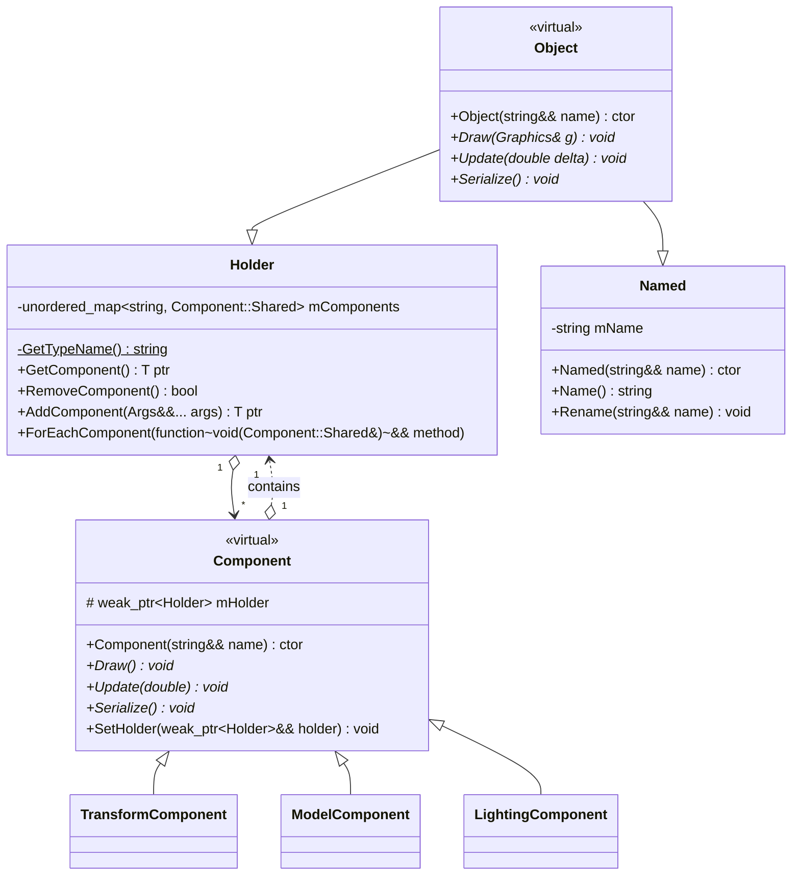
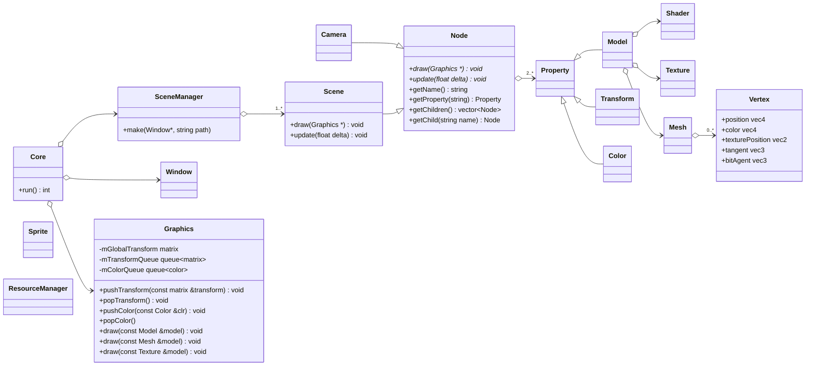

<div align="center">

# **_MEOV_**

**Minimalistic Easy Object Viewer**: lightweight and easy-to-use 3D object viewer.


</div>


**‼️ Note**: this project is currently under development.

## **Diagrams:**

### `Named`, `Virtual` and `Component` classes diagram:



### (OLD) Main scene things diagram:



## (Not implemented) JSON configuration file example:

```json
[
  {
    "name": "MainCamera",
    "type": "camera",
    "properties": {
      "transform": {
        "position": {
          "x": 0,
          "y": 0,
          "z": 0
        },
        "rotation": {
          "x": 0,
          "y": 0,
          "z": 0
        },
        "scale": {
          "x": 0,
          "y": 0,
          "z": 0
        }
      }
    }
  },
  {
    "name": "Model",
    "type": "node",
    "properties": {
      "transform": {
        "position": {
          "x": 0,
          "y": 0,
          "z": -10
        },
        "rotation": {
          "x": 0,
          "y": 0,
          "z": 0
        },
        "scale": {
          "x": 0,
          "y": 0,
          "z": 0
        }
      },
      "model": {
        "path": "path/to/object.obj"
      }
    }
  }
]
```
