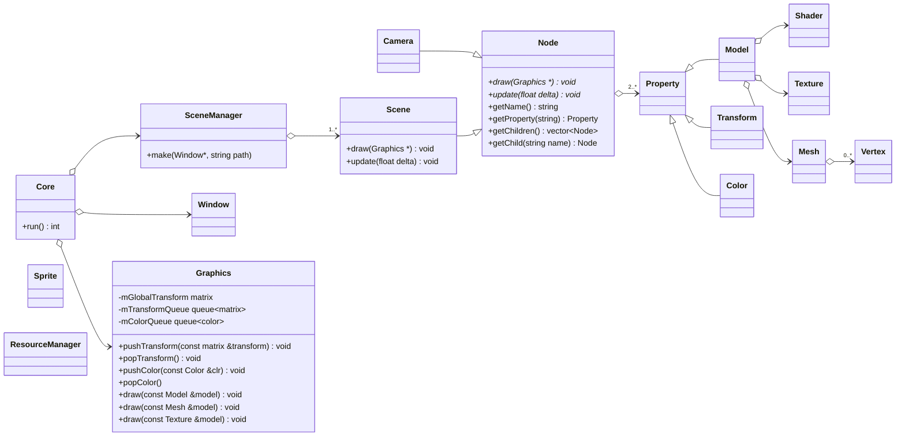

# **_MEOV_**

**Minimalistic Easy Object Viewer**: lightweight and easy-to-use 3D object viewer.

## **Scheme:**

```json
[
  {
    "name": "MainCamera",
    "type": "camera",
    "properties": {
      "transform": {
        "position": {
          "x": 0,
          "y": 0,
          "z": 0
        },
        "rotation": {
          "x": 0,
          "y": 0,
          "z": 0
        },
        "scale": {
          "x": 0,
          "y": 0,
          "z": 0
        }
      }
    }
  },
  {
    "name": "Model",
    "type": "node",
    "properties": {
      "transform": {
        "position": {
          "x": 0,
          "y": 0,
          "z": -10
        },
        "rotation": {
          "x": 0,
          "y": 0,
          "z": 0
        },
        "scale": {
          "x": 0,
          "y": 0,
          "z": 0
        }
      },
      "model": {
        "path": "path/to/object.obj"
      }
    }
  }
]
```



```cpp

meov::Core::Core()
    : mGraphics{ std::make_unique<Graphics>() }
{
    // initialize
}

int meov::Core::run() {
    Time timer;

    while(mWindow->isOpen()) {
        mScene->update(timer.getDelta());
        mWindow->update(timer.getDelta());

        mScene->render(mGraphics);
        mWindow->draw(mGraphics);
    }

    return 0;
}

```
