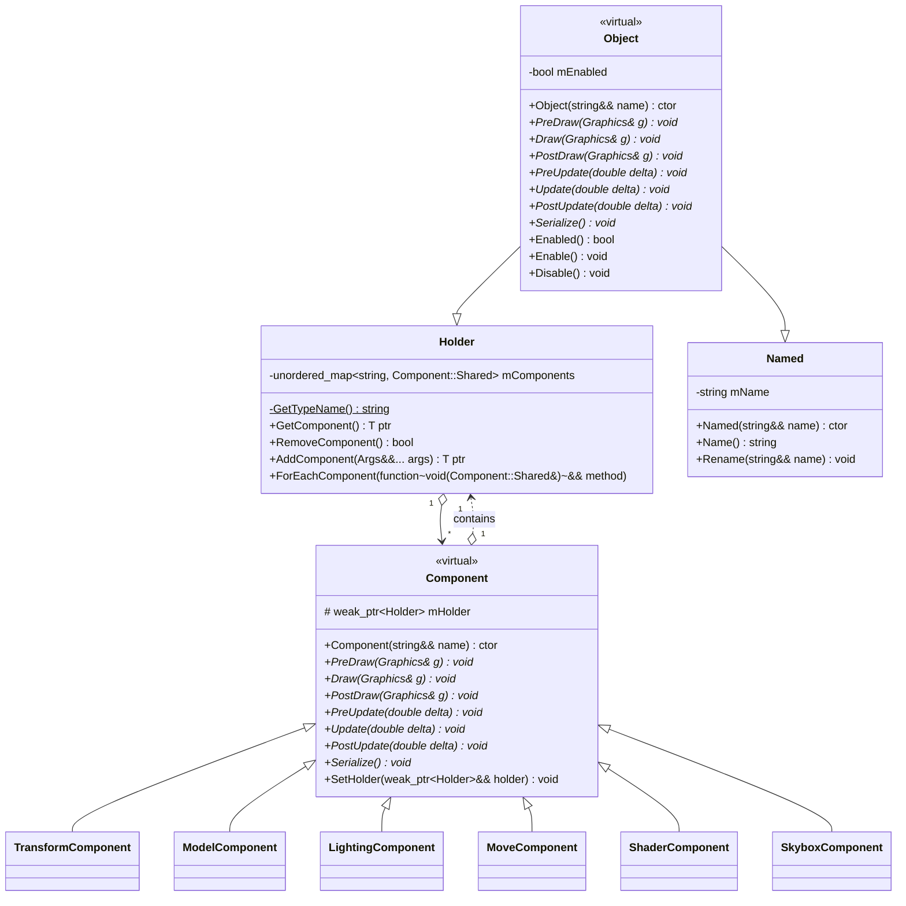

# **_MEOV_**

**Minimalistic Easy Object Viewer**: fast, lightweight, powerful and easy-to-use 3D object viewer.

## Reason

Most of the services and programs for viewing 3D objects occupy a lot of space on the drive, piled with a lot of functionality, not required for a simple model viewer, are inconvenient or even paid.

The main goal of this project is to design, create and release a universal application for viewing 3D models, which does not take up a lot of disk space and supports a large number of model formats.

## Requirements

At this stage of development, the software product has been tested on the operating systems of the `Microsoft Windows` family and functions correctly.
There was no testing on `Linux`, but it is a goal for the foreseeable future.

The application will require the latest version of the `Microsoft Visual C++ Redistributable` to be installed on the computer.

## Usage

To change the direction of view you need to `hold the computer mouse wheel`.

Movement on the scene is done using the `WASDQE` keys.

To open your own model files you need to put them in the «`assets`» directory. Change the `model component` of the «`Test object`» and it will be ready to go!

## Scope

Any spheres connected with the use of 3D models:

- modeling and design;
- computer graphics;
- development of game applications;
- research and development;
- biological and scientific modeling;
- architectural/construction modeling;
- education;
- cinematography;
- animation;
- advertising agencies and many others.

## Languages

- The main program code of the application is implemented with `C++`;
- shaders - `GLSL`;
- automated build - `CMake Language`.

## Logs

The program generates logs containing records in chronological order about all important status changes, certain user and application actions, in the embedded widget, in the file and in the terminal window.

## Dependencies

External dependencies are connected to the project using the `Git submodules`.

The project is stand-alone application that does not need any dependencies to install and use it (except `Microsoft Visual C++ Redistributable`).

All necessary libraries are linked `statically`.

## Components

- `transform component` sets object on stage and their scale;
- `move component` adds ability to change position of object by pressing keyboard key;
- `camera component` creates an observer on the stage. You can configure its:
  - `sensitivity`;
  - `zoom`;
  - `near` and `far`;
  - `pitch`;
  - `view matrix`;
  - `projection matrix`.
- `skybox component` sets the object photorealistic textures of the sky, informs about the name and status of the texture, and allows you to reboot the mesh of the object;
- `model component` adds model to object, informs about the name and path to model file, displays all its meshes and their textures, and allows you to replace the model using the file selection dialog box;
- `shader component` adds the ability of the object to have its own vertex and geometric shaders, allows them to be turned on and off if necessary, and informs about the status of their functioning;
- `directional light`, `spot light` and `point light` components make the object an appropriate source of lighting on the stage and allows you to adjust all the necessary parameters depending on its type.

## Classes

`Core` is the fundamental class within the project. This class is used for the main cycle (the "Game Loop" design pattern). This entity is responsible for updating all objects and their components by using the the "Update Method" design pattern. On each frame, the application updates all objects from this collection. Together with the update of individual blocks, the main loop monitors input data from the user and operating system.

The basic components of the application are initialized and de-initialized using the class `Initializer`.

The entity of the `scene` in the application source code is represented as configurable object `components`. For the design and creation of `components` the «Component» pattern is used. Configuration is possible by inheritance between the `Holder` and `Object` classes. `Holder` provides a mechanism for creating, removing, and accessing `components` that determine the behavior of an object.

Each component implements the methods it needs and adds new features.

To obtain resources, the `Loader` class and its specific implementation for Assimp (`AssimpLoader`) are used. The `Loader` object provides methods for loading resources to the program by the given path.

The `Manager` class is a resource manager that is implemented using the singleton application design pattern.

The project also has an event manager, divided into two static classes - a mouse manager (`MouseManager`) and a keyboard manager (`KeyboardManager`).

The `FrameBuffer` class is a set of buffers used as a destination for rendering.

The `Graphics` class encapsulates and implements graphical content, providing unified access to GPU resources.

The `Base` class is a basic window interface from which classes that implement a specific interface are inherited.

## Widgets

- `Scene` on which the objects of the model, light sources and skybox are located;
- `Scene tree` is a widget that displays all objects on the stage and allows you to click on the objects to open their properties in a separate widget;
- `Properties` contains the components of the objects selected in the tree;
- `Git information` provides information about the current version of Git commit (hash, message, and commit date);
- `Logger` displays real-time records about important changes in the state of the application, successful or unsuccessful loading of models, textures, shaders, critical application errors and others.

All widgets use `docking` technology, allowing them to attach to each other and to the main graphical window of the application in any order and location.

**‼️ Note**: this project is currently under development.

## **Diagrams:**

### Object components system:

