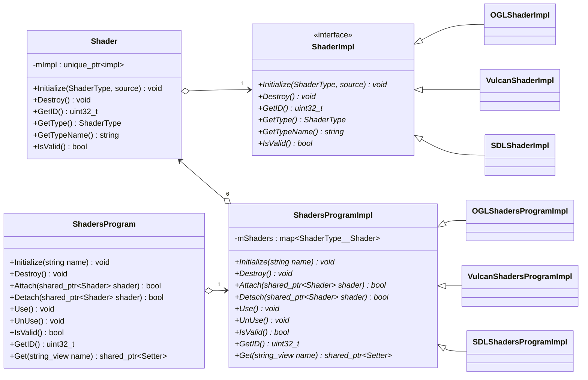

# **_Shaders_**

## **Scheme:**

```mermaid
classDiagram
    direction LR

    class ShaderImpl {
        <<interface>>
        +Initialize(ShaderType, source)* void
        +Destroy()* void

        +GetID()* uint32_t
        +GetType()* ShaderType
        +GetTypeName()* string
        +IsValid()* bool
    }

    ShaderImpl <|-- OGLShaderImpl
    ShaderImpl <|-- VulcanShaderImpl
    ShaderImpl <|-- SDLShaderImpl

    Shader o--> "1" ShaderImpl
    Shader <--o "6" ShadersProgramImpl
    class Shader {
        -mImpl : unique_ptr~impl~

        +Initialize(ShaderType, source) void
        +Destroy() void

        +GetID() uint32_t
        +GetType() ShaderType
        +GetTypeName() string
        +IsValid() bool
    }

    class ShadersProgramImpl {
        -mShaders : map~ShaderType__Shader~

        +Initialize(string name)* void
        +Destroy()* void

        +Attach(shared_ptr~Shader~ shader)* bool
        +Detach(shared_ptr~Shader~ shader)* bool

        +Use()* void
        +UnUse()* void

        +IsValid()* bool
        +GetID()* uint32_t

        +Get(string_view name)* shared_ptr~Setter~
    }

    ShadersProgramImpl <|-- OGLShadersProgramImpl
    ShadersProgramImpl <|-- VulcanShadersProgramImpl
    ShadersProgramImpl <|-- SDLShadersProgramImpl

    ShadersProgram o--> "1" ShadersProgramImpl
    class ShadersProgram {
        +Initialize(string name) void
        +Destroy() void

        +Attach(shared_ptr~Shader~ shader) bool
        +Detach(shared_ptr~Shader~ shader) bool

        +Use() void
        +UnUse() void

        +IsValid() bool
        +GetID() uint32_t

        +Get(string_view name) shared_ptr~Setter~
    }
```

