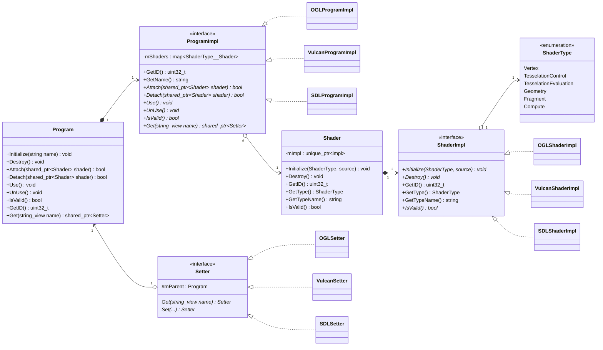

# **_Shaders_**

## **Scheme:**

```mermaid
classDiagram
    direction LR


    class ProgramImpl {
        <<interface>>
        -mShaders : map~ShaderType__Shader~

        +GetID() uint32_t
        +GetName() string

        +Attach(shared_ptr~Shader~ shader)* bool
        +Detach(shared_ptr~Shader~ shader)* bool

        +Use()* void
        +UnUse()* void

        +IsValid()* bool
        +Get(string_view name)* shared_ptr~Setter~
    }

    ProgramImpl <|.. OGLProgramImpl
    ProgramImpl <|.. VulcanProgramImpl
    ProgramImpl <|.. SDLProgramImpl
    ProgramImpl "6" o--> "1" Shader

    Program "1" *--> "1" ProgramImpl
    class Program {
        +Initialize(string name) void
        +Destroy() void

        +Attach(shared_ptr~Shader~ shader) bool
        +Detach(shared_ptr~Shader~ shader) bool

        +Use() void
        +UnUse() void

        +IsValid() bool
        +GetID() uint32_t

        +Get(string_view name) shared_ptr~Setter~
    }

    class ShaderType {
        <<enumeration>>
        Vertex
        TesselationControl
        TesselationEvaluation
        Geometry
        Fragment
        Compute
    }

    ShaderImpl "1" o--> "1" ShaderType
    class ShaderImpl {
        <<interface>>
        +Initialize(ShaderType, source)* void
        +Destroy()* void

        +GetID() uint32_t
        +GetType() ShaderType
        +GetTypeName() string
        +IsValid()* bool
    }

    ShaderImpl <|.. OGLShaderImpl
    ShaderImpl <|.. VulcanShaderImpl
    ShaderImpl <|.. SDLShaderImpl

    Shader "1" *--> "1" ShaderImpl
    class Shader {
        -mImpl : unique_ptr~impl~

        +Initialize(ShaderType, source) void
        +Destroy() void

        +GetID() uint32_t
        +GetType() ShaderType
        +GetTypeName() string
        +IsValid() bool
    }

    Program "1" <--o "1" Setter
    class Setter {
        <<interface>>
        Get(string_view name)* Setter
        Set(...)* Setter
        #mParent : Program
    }

    Setter <|.. OGLSetter
    Setter <|.. VulcanSetter
    Setter <|.. SDLSetter

    %% ShadersProgram file
    link Program "https://github.com/seigtm/meov/blob/4b6cd9a1a2e4a6e92851244be6fa3d15aa7e7ff4/src/core/shaders/ShadersProgram/ShadersProgram.hpp"
    link Setter "https://github.com/seigtm/meov/blob/4b6cd9a1a2e4a6e92851244be6fa3d15aa7e7ff4/src/core/shaders/ShadersProgram/ShadersProgram.hpp"
    link ProgramImpl "https://github.com/seigtm/meov/blob/4b6cd9a1a2e4a6e92851244be6fa3d15aa7e7ff4/src/core/shaders/ShadersProgram/ShadersProgram.hpp"

    %% OGLShaderProgramImpl
    link OGLProgramImpl "https://github.com/seigtm/meov/blob/4b6cd9a1a2e4a6e92851244be6fa3d15aa7e7ff4/src/core/shaders/ShadersProgram/impl/ogl/OGLShadersProgram.hpp"
    link OGLSetter "https://github.com/seigtm/meov/blob/4b6cd9a1a2e4a6e92851244be6fa3d15aa7e7ff4/src/core/shaders/ShadersProgram/impl/ogl/OGLShadersProgram.hpp"

    %% Shader file
    link Shader "https://github.com/seigtm/meov/blob/4b6cd9a1a2e4a6e92851244be6fa3d15aa7e7ff4/src/core/shaders/Shader/Shader.hpp"
    link ShaderImpl "https://github.com/seigtm/meov/blob/4b6cd9a1a2e4a6e92851244be6fa3d15aa7e7ff4/src/core/shaders/Shader/Shader.hpp"
    link ShaderType "https://github.com/seigtm/meov/blob/4b6cd9a1a2e4a6e92851244be6fa3d15aa7e7ff4/src/core/shaders/Shader/Shader.hpp"

    %% OGLShader file
    link OGLShaderImpl "https://github.com/seigtm/meov/blob/4b6cd9a1a2e4a6e92851244be6fa3d15aa7e7ff4/src/core/shaders/Shader/impl/ogl/OGLShader.hpp"
```

